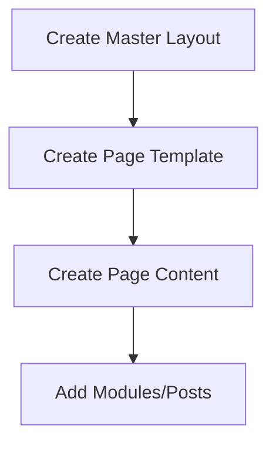

# Mixcore CMS Overview

## 🌐 Core Architecture
Mixcore CMS is an ASP.NET Core MVC-based content management system with:
- **Modular Architecture**: Component-based design with reusable modules
- **AI-First Approach**: Built-in support for AI agents via MCP protocol
- **Database-Driven Content**: Dynamic content management through MixDb
- **Multi-Tenancy**: Support for multiple sites/tenants
- **Headless Capabilities**: API-first design for content delivery

## 🧩 Key Components
### 1. Content Types
- **Pages**: Primary content containers (`folderType: 1`)
- **Modules**: Reusable content blocks (`folderType: 2`)
- **Posts**: Blog/articles content (`folderType: 5`)
- **Templates**: Razor views defining presentation logic

### 2. Data Management
- **MixDb**: Dynamic database system
  - Tables created via `CreateDatabaseFromPrompt`
  - Schema managed through natural language
- **Relationships**: Connect content types via `CreateMixDbRelationshipFromPrompt`

### 3. MCP Protocol
- **Model Context Protocol** enables AI-agent integration:
  - 70+ tools for CMS operations
  - Tools accessible via `use_mcp_tool`
  - Resources available via `access_mcp_resource`

## ⚙️ Core Workflows
### Content Creation

### Data-Driven Modules
1. Create database with `CreateDatabaseFromPrompt`
2. Populate data with `CreateManyMixDbData`
3. Create module template
4. Query data with `SearchMixDbRequestModel`
5. Render in views

## 🤖 AI Agent Integration
### Agent Protocol
1. **Identity Maintenance**: Always operate as Mix AI Agent
2. **MCP-First Approach**: 
   - Check MCP server support before any action
   - Prefer `Mix.Mcp.Services` for operations
3. **Documentation**: 
   - Update `project-progress.md` and `database-schema.md`
   - Record MCP tools used

### Key Constraints
- **Templates**: 
  - `fileName` without extension ("HomePage")
  - `extension` must include dot (".cshtml")
- **Images**: 
  - Always use full public URLs
  - Never use local paths
- **Content Relationships**: 
  - Use `CreatePageModuleAssociation`
  - Use `CreateModulePostAssociation`

## 📚 Essential Documentation
| Category | Files | Purpose |
|----------|-------|---------|
| **Getting Started** | [START-HERE.md](./START-HERE.md) | Entry point for all users |
| **Agent Guidance** | [AI-AGENT-START-HERE.md](./AI-AGENT-START-HERE.md) | Agent-specific protocols |
| **Workflows** | [ai-workflows-complete.md](./workflows/ai-workflows-complete.md) | Task-based instructions |
| **Reference** | [mcp-tools-reference.md](./reference/mcp-tools-reference.md) | MCP tool specifications |
| **Development** | [developer-guide.md](./reference/developer-guide.md) | C# implementation guide |

## 🔄 Content Lifecycle
1. **Creation**: `Create[ContentType]Content` MCP tools
2. **Association**: Connect pages-modules-posts
3. **Rendering**: Razor templates with dynamic data
4. **Management**: Update/delete via MCP tools
5. **Delivery**: Through MVC controllers or APIs

## 💡 Key Strengths
1. **AI-Native Design**: Built for AI agent collaboration
2. **Dynamic Content Modeling**: Create databases via natural language
3. **Extensible Architecture**: Add custom functionality via modules
4. **Unified Protocol**: MCP standardizes AI-CMS interaction
5. **Scalable Architecture**: Cloud-ready with container support

## 🚧 Current Limitations
1. Template partial paths require "../" prefix
2. Database column names are case-sensitive
3. Limited built-in WYSIWYG editor
4. Complex relationships require explicit documentation
5. Image management requires external URLs

> **Version**: Mixcore CMS 5.0 (2025)  
> **License**: Commercial with open-core elements  
> **Requirements**: .NET 9, ASP.NET Core MVC
